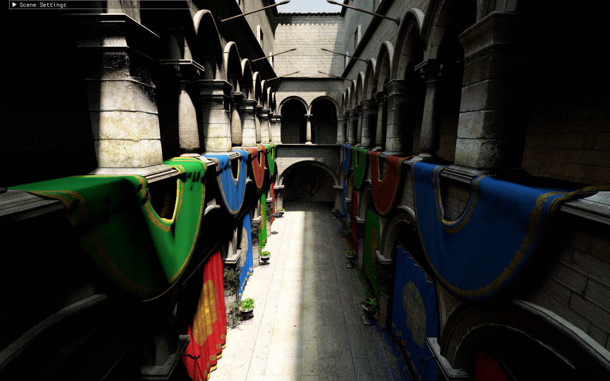
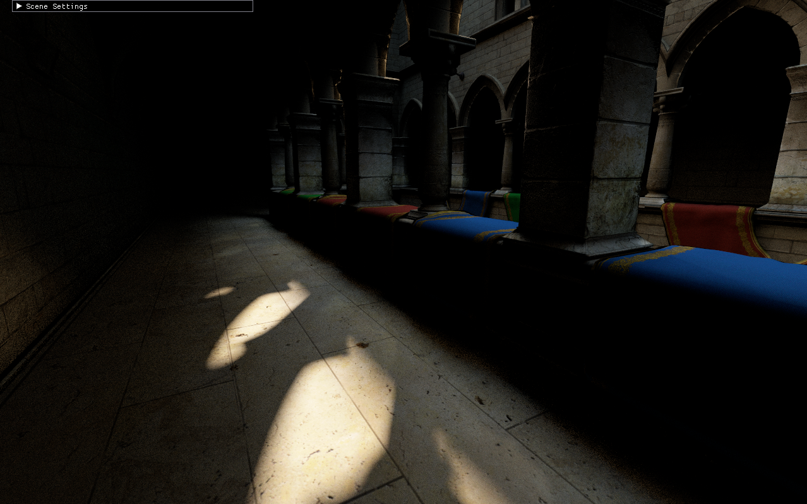

# Vera
## About application
Vera is a path tracer written using C++ and Vulkan with included:
- 3D model .obj files handling,
- normal mapped objects support,
- simple viewer player functionality,
- GUI implemented with ImGui to control sun and light properties,
- Vulkan Memory Allocator integration
- cross-platform compatibility (compiled and tested both on Windows and Ubuntu).

I am sure that the list will expand in the future with:
- animations,
- FBX format integration,
- some denoiser (probably NRD from NVIDIA).
- better tests for rendering API use cases
- static analysis stage for CI/CD pipeline

## How to run:
Application is written using CMake so the easiest way to compile and run is to fetch submodules and open the project in some IDE. Remember that you will need to have graphics card that supports ray tracing and Vulkan SDK installed.

To control the viewer player you can use:
- W/S to move forward/backward,
- A/D to move left/right,
- Q/E to move up/down,
- UP/DOWN arrows to look up/down,
- LEFT/RIGHT arrows to look left/right.

Here are nice views of what will you encounter if you run the application.

## Quick overview of files and folders structure

### Project directory

Contains project description files used to load necessary meshes and prepare objects for scene

### Resources directory

Contains three other folders:
- Materials (with Vera material description files),
- Models (with .obj model files with their material files),
- Textures (with .png textures).

### Source directory

Contains all C++ source. Divided in subdirectories which are responsible for:
- Assets: assets loading and storing in GPU accessible memory
- Editor: GUI and Window handling
- Input: input handling
- Logs: logging for debugging
- Memory: memory management and allocation
- Objects: world objects and object components logic
- Project: loading and saving project info
- RenderEngine: implementation of rendering functionality
- Utils: helper functions
- World: management of world objects

## Contributors
* [Mateusz Gancarz](https://github.com/magancarz)
