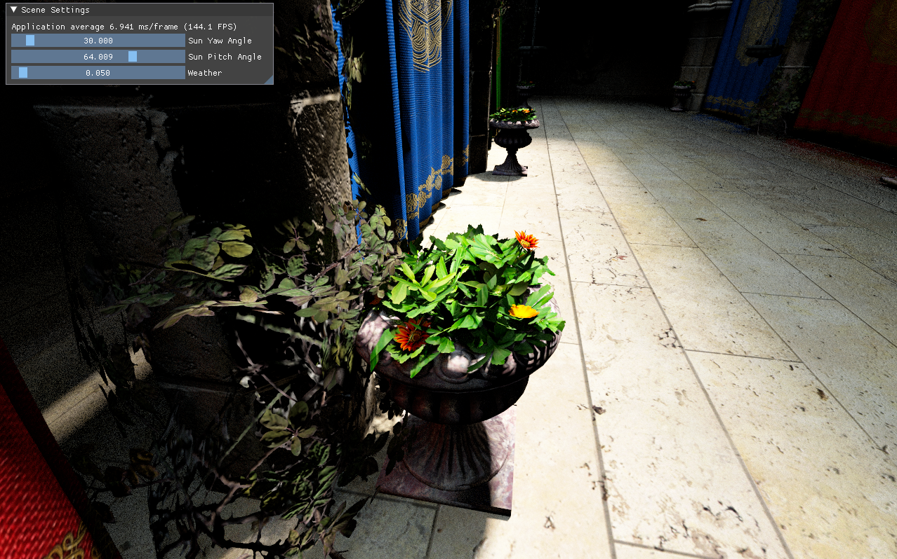
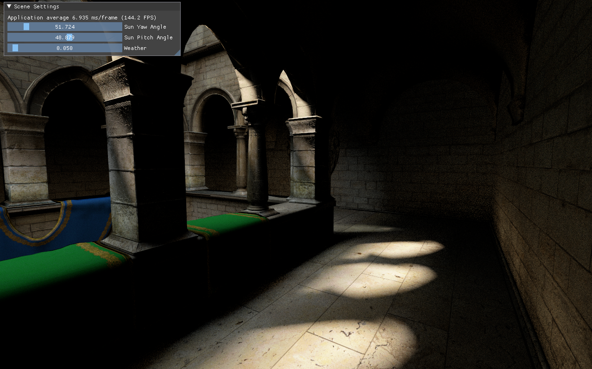
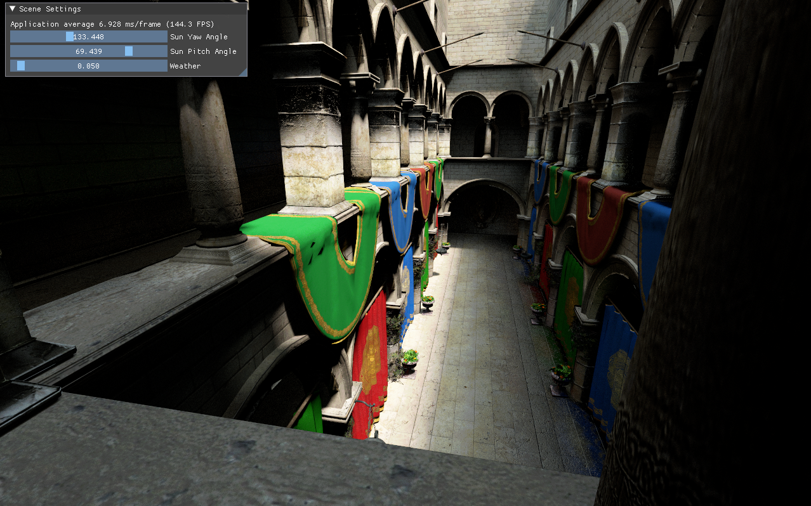

# Vera
## About application
Vera is a path tracer written using C++ and Vulkan. It includes such features as:
- support for 3D .obj model files,
- support for normal mapped models,
- simple player viewer functionality,
- GUI implemented with ImGui to control sun and light properties,
- integration of Vulkan Memory Allocator
- cross-platform compatibility (compiled and tested on both Windows and Linux).

I am sure that the list will expand in the future with:
- animations (I will especially start with animating plants that occur on the sponza map),
- static analysis stage for CI/CD pipeline
- better tests for rendering API use cases
- some denoiser to reduce the need of accumulating and averaging generated images (probably NRD denoiser from NVIDIA).
- FBX format integration,
- development of more game engine oriented features and create some basis for game development

## How to run:
Application is written using CMake so the easiest way to compile and run is to fetch git submodules and open the project in some IDE. Remember that you will need to have a graphics card that supports the ray tracing and have Vulkan SDK installed. Also install all packages that are missing while compiling the code. Remember that working directory should be set to the directory where the project is located, i.e. C:/dev/Vera/{project_contents}.

To control the viewer player you can use:
- W/S to move forward/backward,
- A/D to move left/right,
- Q/E to move up/down,
- UP/DOWN arrows to look up/down,
- LEFT/RIGHT arrows to look left/right.

You can also control the direction of the sun by manipulating the GUI at the top left of the window. The sun's pitch and yaw angles control the direction of the sunlight, and the weather controls the amount of light scattered around.

Here are some nice views of what you might encounter when you launch the app.

## Quick overview of files and folders structure

### Project directory

Contains the project description files used to load necessary meshes and prepare objects for the scene

### Resources directory

Contains three other folders:
- Materials (with Vera material description files),
- Models (with .obj model files with their material files),
- Textures (with .png textures).

### Source directory

Contains all the C++ source. Divided into subdirectories which are responsible for:
- Assets: loading and storing resources in GPU-accessible memory
- Editor: GUI and window handling
- Input: handling input data
- Logs: logging for debugging purposes
- Memory: buffer memory management and allocation
- Objects: logic for world objects and object components
- Project: loading and saving project information
- RenderEngine: implementation of rendering functions
- Utils: helper functions
- World: managing world objects

## Contributors
* [Mateusz Gancarz](https://github.com/magancarz)
